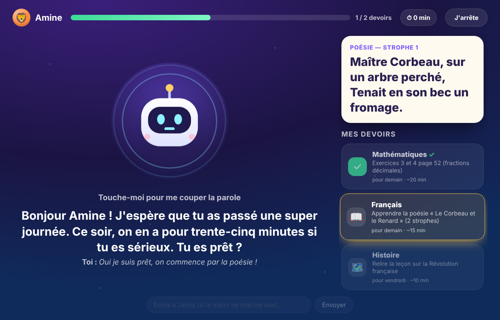

# Jarvis Junior — l'instit vocal des devoirs

Application Mac qui aide **Amine (CM2)** et **Ibrahim (5e)** à faire leurs devoirs, **à la voix**.
Les parents envoient les devoirs en photo sur Telegram et reçoivent un rapport à la fin de chaque séance.

<p align="center"></p>

| Choix du profil | Séance de devoirs |
|---|---|
|  |  |

## Comment ça marche

1. **Les parents** envoient une photo des devoirs au bot Telegram (cahier de textes, Pronote, ENT…).
   Mettez le prénom en légende si vous voulez ; sinon Jarvis devine d'après le niveau, et vous demande
   en cas de doute. Il répond avec la liste organisée (matière, consigne, date, durée estimée) et
   prévient l'autre parent.
   Pour corriger, il suffit d'écrire : « c'est pour jeudi », « enlève la poésie », « c'est pour Ibrahim ».
2. **L'enfant** double-clique sur l'icône **Jarvis Junior** du bureau, choisit son profil et tape son
   code secret.
3. **Jarvis l'accueille** : « Bonjour Amine ! J'espère que tu as passé une bonne journée. Ce soir, on en
   a pour environ 35 minutes si tu es sérieux. Tu es prêt ? »
4. **Il propose le devoir** (ou laisse l'enfant choisir s'il y en a plusieurs), puis **l'aide comme un
   instit** : questions, indices de plus en plus précis, réexplication avec un autre exemple. Il ne
   donne **jamais** la réponse. Il fait réciter les leçons et les poésies, affiche en grand un calcul ou
   un mot à épeler, et propose une pause toutes les 20 minutes (Amine) ou 30 minutes (Ibrahim).
5. **À la fin**, il remercie l'enfant, et **les deux parents reçoivent un rapport** :

   ```
   📚 Rapport de devoirs — Amine

   ✅ Amine a terminé ses devoirs (38 min).

   ✔︎ Mathématiques — Exercices 3 et 4 p. 52 : réussi après deux indices
   ✔︎ Français — Poésie : sue presque par cœur

   📝 Séance agréable, Amine était concentré.

   ⚠️ Difficultés :
   • Confond 0,25 et 2,5 dans les conversions

   🔁 À renforcer :
   • 5 minutes de conversions fractions / décimaux demain
   ```

   Si l'enfant s'arrête en cours de route (bouton « J'arrête » ou fermeture de la fenêtre), le rapport
   part quand même, avec ce qui reste à faire.

**Jarvis s'améliore au fil des semaines** : il retient les difficultés de chaque enfant et les fait
retravailler. Vous pouvez aussi lui donner des consignes par Telegram (« insiste sur les tables de 7 »,
« Ibrahim a un contrôle d'histoire jeudi ») : il en tient compte aux séances suivantes. Vous pouvez
aussi lui demander « qu'a fait Amine ce soir ? » ou « sur quoi Ibrahim bloque en ce moment ? ».

## Ce dont vous avez besoin

- Le Mac (puce M3) : la reconnaissance vocale (Whisper) tourne **sur le Mac**, sans envoyer la voix des
  enfants à un service extérieur.
- Une **clé API Claude** : https://console.anthropic.com → *API Keys* (facturation à l'usage).
- **Telegram** sur le téléphone de chaque parent.
- Python 3.11+ : si besoin, installez Homebrew (https://brew.sh) puis `brew install python@3.12`.

## Installation (une seule fois, environ 10 minutes)

1. Sur Telegram, ouvrez **@BotFather**, envoyez `/newbot`, choisissez un nom (ex : « Jarvis Junior
   Maison »). Gardez le **token** qu'il vous donne.
2. Dans le Terminal, depuis le dossier du projet :

   ```bash
   ./install_mac.sh
   ```

   L'assistant vous demande :
   - la clé API Claude et le token Telegram (rangés dans le **Trousseau** macOS) ;
   - que **chaque parent envoie `/start` au bot** depuis son téléphone : vous êtes reconnus automatiquement ;
   - la classe, l'avatar et le **code secret à 4 chiffres** de chaque enfant ;
   - le **code parent** (pour l'espace parents de l'application) ;
   - la voix de Jarvis.
3. C'est prêt : l'icône **Jarvis Junior** est sur le bureau. Au premier lancement, **autorisez le micro**.

Le service Telegram démarre tout seul à chaque ouverture de session : vous pouvez envoyer les devoirs
même quand l'application est fermée. Le Mac doit être allumé ; si vous envoyez une photo quand il est
éteint, elle est traitée au rallumage.

### Pour une voix plus naturelle (fortement conseillé)

Réglages Système → Accessibilité → Contenu énoncé → Voix du système → **Gérer les voix…** → Français →
téléchargez **« Audrey (Premium) »** ou **« Thomas (Premium) »**. Relancez ensuite
`~/Library/Application\ Support/JarvisJunior/venv/bin/python -m junior setup` pour la choisir.

## Utilisation au quotidien

| Qui | Quoi |
|---|---|
| Parent | Envoie la photo des devoirs au bot (légende « Amine » ou « Ibrahim » facultative) |
| Parent | Corrige ou complète par message : « ajoute : apprendre la leçon 4 pour vendredi » |
| Enfant | Ouvre l'app → son profil → son code → parle avec Jarvis |
| Enfant | **Touche le robot** (ou la barre d'espace) pour lui couper la parole ou pour parler |
| Parent | Reçoit le rapport à la fin de la séance |
| Parent | Dans l'app, **🔒 Espace parents** : liste des devoirs (ajout, suppression) et historique des rapports |

La conversation se fait **mains libres** : après chaque réponse, Jarvis écoute l'enfant
automatiquement. Si l'enfant ne dit rien, il attend qu'on touche le robot. Une petite zone de saisie
en bas de l'écran permet d'écrire à Jarvis si le micro ne fonctionne pas.

## Réglages (`~/Library/Application Support/JarvisJunior/config.json`)

| Clé | Défaut | Effet |
|---|---|---|
| `children[].break_every` | 20 (Amine), 30 (Ibrahim) | Minutes de travail avant de proposer une pause |
| `tutor_effort` | `"low"` | `low` = réponses rapides à l'oral ; `medium` = réflexion plus poussée, un peu plus lent |
| `voice`, `voice_rate` | meilleure voix française, 180 | Voix et vitesse de Jarvis |
| `whisper_model` | `mlx-community/whisper-large-v3-turbo` | Modèle de reconnaissance vocale |
| `model` | `claude-opus-5-5` | Modèle Claude |

## Sécurité et vie privée

- L'application des enfants **ne peut rien faire sur le Mac** : pas de terminal, pas de fichiers,
  pas d'internet hors Claude. Elle ne sert qu'aux devoirs, et ramène gentiment l'enfant au travail
  s'il parle d'autre chose.
- La **voix** des enfants est transcrite **sur le Mac**. Seul le texte de la conversation et les photos
  de devoirs sont envoyés à Claude.
- Les **codes** sont stockés chiffrés (empreinte PBKDF2). La clé API et le token sont dans le Trousseau.
- Seuls les parents enregistrés peuvent parler au bot Telegram.
- Si un enfant évoque quelque chose de préoccupant, Jarvis l'invite à en parler à ses parents et le
  signale clairement dans le rapport.

## Dépannage

- **Jarvis n'entend rien** : Réglages Système → Confidentialité et sécurité → Micro → activez
  « Jarvis Junior ».
- **Pas de rapport sur Telegram** : vérifiez le service avec
  `tail ~/Library/Application\ Support/JarvisJunior/daemon.log`.
- **L'application ne s'ouvre pas** : regardez `~/Library/Application Support/JarvisJunior/app.log`.
- **Tout réinstaller** : relancez `./install_mac.sh` (vos données sont conservées).
- **Désinstaller** : `~/Library/Application\ Support/JarvisJunior/venv/bin/python -m junior uninstall`.

## Bientôt

- Vérification du cahier par la caméra (iPhone en « Vue du bureau » ou caméra sur bras).
