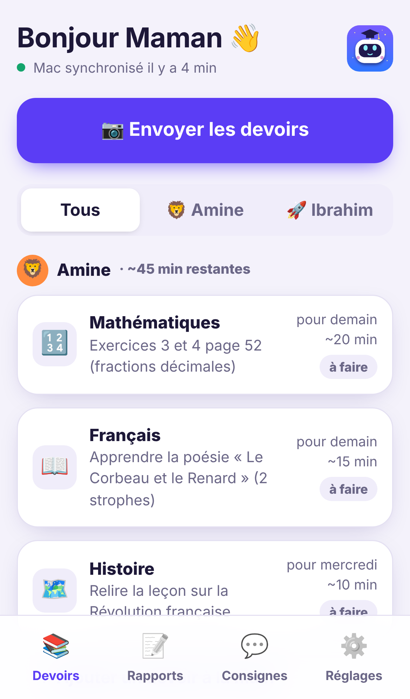
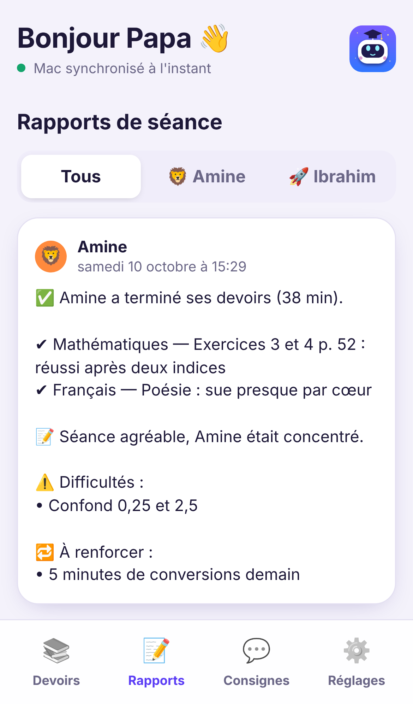

# Jarvis Junior — l'instit vocal des devoirs

Application Mac qui aide **Amine (CM2)** et **Ibrahim (5e)** à faire leurs devoirs, **à la voix**,
avec un **espace parents** en ligne (sur Netlify) : vous y envoyez les devoirs en photo depuis votre
téléphone et vous y recevez le rapport de chaque séance, avec une notification.

<p align="center"></p>

| Choix du profil (Mac) | Séance de devoirs (Mac) |
|---|---|
|  |  |

| Espace parents : devoirs (téléphone) | Espace parents : rapports (téléphone) |
|---|---|
|  |  |

## Comment ça marche

1. **Un parent** ouvre l'espace parents sur son téléphone, touche **📷 Envoyer les devoirs** et prend
   en photo le cahier de textes (ou Pronote, l'ENT…). Il peut choisir l'enfant ou laisser Jarvis
   **deviner** d'après le niveau. Quelques secondes plus tard, la liste est prête : matière, consigne,
   date, durée estimée. **L'autre parent reçoit une notification.** Un devoir se corrige d'un toucher.
2. **L'enfant** double-clique sur l'icône **Jarvis Junior** du bureau du Mac, choisit son profil et
   tape son code secret.
3. **Jarvis l'accueille** : « Bonjour Amine ! J'espère que tu as passé une bonne journée. Ce soir, on en
   a pour environ 35 minutes si tu es sérieux. Tu es prêt ? »
4. **Il propose le devoir** (ou laisse l'enfant choisir s'il y en a plusieurs), puis **l'aide comme un
   instit**, sans jamais donner la réponse : questions, indices de plus en plus précis, réexplication avec
   un autre exemple, récitation des leçons, calcul ou mot affiché en grand, pauses régulières.
5. **À la fin**, il remercie l'enfant, et **les deux parents reçoivent une notification** avec le rapport :
   ce qui est fait, les difficultés, et ce qu'il faut renforcer. Si l'enfant s'arrête en cours de route,
   le rapport part quand même.

Dans l'espace parents, l'onglet **Consignes** permet de donner des instructions à Jarvis
(« insiste sur les tables de 7 », « contrôle d'histoire jeudi ») : il en tient compte aux séances
suivantes. Les difficultés repérées au fil des semaines y sont listées.

## Ce dont vous avez besoin

- Le **Mac** (puce M3) : la reconnaissance vocale tourne **sur le Mac**, sans envoyer la voix des enfants
  à un service extérieur.
- Une **clé API Claude** : https://console.anthropic.com → *API Keys* (facturation à l'usage ; mettez
  5 à 10 € de crédit pour commencer).
- Votre **compte Netlify**.
- Python 3.11+ sur le Mac : si besoin, installez Homebrew (https://brew.sh) puis `brew install python@3.12`.

## Étape 1 — Mettre en ligne l'espace parents (Netlify, 5 minutes)

1. Sur https://app.netlify.com : **Add new site** → **Import an existing project** → **GitHub** →
   choisissez le dépôt **soso**.
2. **Branch to deploy** : `claude/jarvis-assistant` (ou `main` une fois la branche fusionnée).
   Ne touchez à rien d'autre : le fichier `netlify.toml` du dépôt règle tout. Cliquez **Deploy**.
3. **Site configuration → Environment variables → Add a variable**, et créez :
   | Clé | Valeur |
   |---|---|
   | `ANTHROPIC_API_KEY` | votre clé Claude (`sk-ant-…`) — sert à lire les photos de devoirs |
   | `PARENT_PASSWORD` | un **mot de passe familial** de votre choix (les deux parents et le Mac l'utilisent) |
4. **Deploys → Trigger deploy → Deploy site** (pour que les variables soient prises en compte).
5. Facultatif : **Site configuration → Change site name** → par exemple `jarvis-famille`
   (adresse : `https://jarvis-famille.netlify.app`).

## Étape 2 — Installer l'application sur le Mac (10 minutes)

1. Téléchargez le projet, puis dans le Terminal :

   ```bash
   cd ~/Downloads/soso-claude-jarvis-assistant
   bash install_mac.sh
   ```

2. L'assistant vous demande :
   - la **clé API Claude** (rangée dans le **Trousseau** macOS) ;
   - la classe, l'avatar et le **code secret à 4 chiffres** de chaque enfant, puis le **code parent**
     (pour l'espace parents intégré à l'application) ;
   - l'**adresse du site Netlify** et le **mot de passe familial** : le Mac se relie à l'espace parents ;
   - la voix de Jarvis.
3. C'est prêt : l'icône **Jarvis Junior** est sur le bureau. Au premier lancement, **autorisez le micro**.

Le Mac se synchronise tout seul avec l'espace parents toutes les 30 secondes, même quand l'application
est fermée (service lancé à l'ouverture de session). S'il est éteint, il rattrape tout à l'allumage.

## Étape 3 — Sur les téléphones des deux parents (2 minutes chacun)

1. Ouvrez l'adresse du site dans **Safari** (iPhone) ou **Chrome** (Android).
2. Choisissez **Papa** ou **Maman**, tapez le mot de passe familial.
3. **iPhone** : touchez **Partager** puis **« Sur l'écran d'accueil »**, puis ouvrez **Jarvis Parents**
   depuis la nouvelle icône. (Apple n'autorise les notifications que de cette façon.)
4. Onglet **Réglages** → **Activer les notifications** → **Autoriser**. Testez avec
   « Envoyer une notification de test ».

## Utilisation au quotidien

| Qui | Où | Quoi |
|---|---|---|
| Parent | Téléphone | 📷 Envoyer les devoirs (photo du cahier de textes) |
| Parent | Téléphone | Toucher un devoir pour le corriger, le déplacer, le supprimer ; ou en ajouter un à la main |
| Parent | Téléphone | Onglet Consignes : instructions pour Jarvis |
| Enfant | Mac | Icône du bureau → son profil → son code → parler avec Jarvis |
| Enfant | Mac | **Toucher le robot** (ou la barre d'espace) pour lui couper la parole ou pour parler |
| Parents | Téléphone | Notification + rapport à la fin de la séance |

La conversation se fait **mains libres** : après chaque réponse, Jarvis écoute l'enfant automatiquement.

## Réglages du Mac (`~/Library/Application Support/JarvisJunior/config.json`)

| Clé | Défaut | Effet |
|---|---|---|
| `children[].break_every` | 20 (Amine), 30 (Ibrahim) | Minutes de travail avant de proposer une pause |
| `tutor_effort` | `"low"` | `low` = réponses rapides à l'oral ; `medium` = plus réfléchi, un peu plus lent |
| `voice`, `voice_rate` | meilleure voix française, 180 | Voix et vitesse de Jarvis |
| `cloud_url` | — | Adresse de l'espace parents |

Pour une voix bien plus naturelle : Réglages Système → Accessibilité → Contenu énoncé → Voix du système →
**Gérer les voix…** → Français → **« Audrey (Premium) »** ou **« Thomas (Premium) »**, puis relancez
`~/Library/Application\ Support/JarvisJunior/venv/bin/python -m junior setup`.

## Sécurité et vie privée

- L'application des enfants **ne peut rien faire sur le Mac** en dehors des devoirs.
- La **voix** des enfants est transcrite **sur le Mac**. Sont envoyés à Claude : le texte de la
  conversation et les photos de devoirs.
- L'espace parents est protégé par le **mot de passe familial** (blocage après 8 essais ratés). Les
  données sont stockées dans votre compte Netlify (Netlify Blobs).
- Les codes des enfants sont stockés sous forme d'empreinte (PBKDF2), la clé API dans le Trousseau.
- Si un enfant évoque quelque chose de préoccupant, Jarvis l'invite à en parler à ses parents et le
  signale clairement dans le rapport.

## Dépannage

- **« Mot de passe familial non configuré »** sur le site : ajoutez `PARENT_PASSWORD` dans Netlify
  puis relancez un déploiement (étape 1, points 3 et 4).
- **La photo reste en « Jarvis lit la photo… »** : vérifiez `ANTHROPIC_API_KEY` sur Netlify. Si votre
  offre Netlify n'inclut pas les fonctions de fond, le **Mac lit la photo à sa place** (dans les
  2 à 3 minutes, s'il est allumé).
- **Le site indique « Mac jamais connecté »** : relancez la configuration du Mac
  (`…/venv/bin/python -m junior setup`) et vérifiez l'adresse du site.
- **Jarvis n'entend rien** : Réglages Système → Confidentialité et sécurité → Micro → activez Jarvis Junior.
- **Pas de notification** sur iPhone : il faut ouvrir Jarvis Parents **depuis l'icône de l'écran
  d'accueil** (pas depuis Safari) pour activer les notifications.
- Journaux du Mac : `~/Library/Application Support/JarvisJunior/app.log` et `daemon.log`.
- Désinstaller l'app du Mac : `~/Library/Application\ Support/JarvisJunior/venv/bin/python -m junior uninstall`.

## Pour les curieux : architecture

```
 Téléphones des parents                 Netlify                              Mac
 ─────────────────────                  ───────                              ───
 Espace parents (web app) ──photo──►  /api (fonctions) ──► Claude (lecture des photos)
           ▲                          Netlify Blobs (devoirs, consignes, rapports)
           └──── notification ◄────── Web Push              ▲   │ synchro toutes les 30 s
                                                            │   ▼
                                                   service de fond (LaunchAgent)
                                                            │
                                     App enfants ◄──────────┘  micro → Whisper local → Claude → voix
```

- `parents/` : le site et ses fonctions Netlify (`npm test` dans ce dossier pour les tests).
- `junior/` : l'application Mac (`pytest` à la racine pour les tests, dont un test de bout en bout
  Mac ↔ espace parents).
